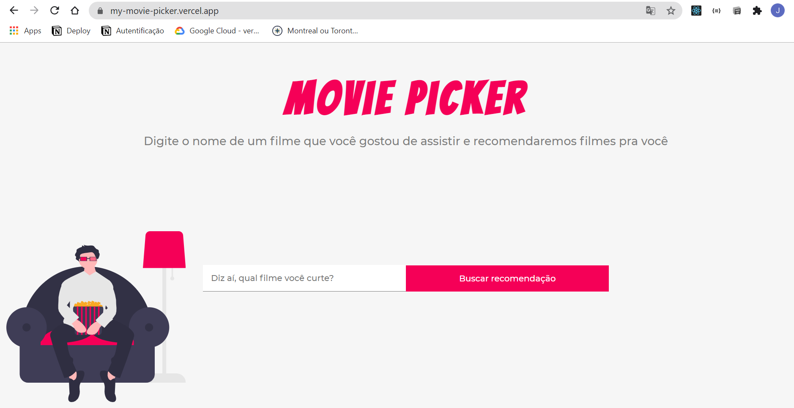
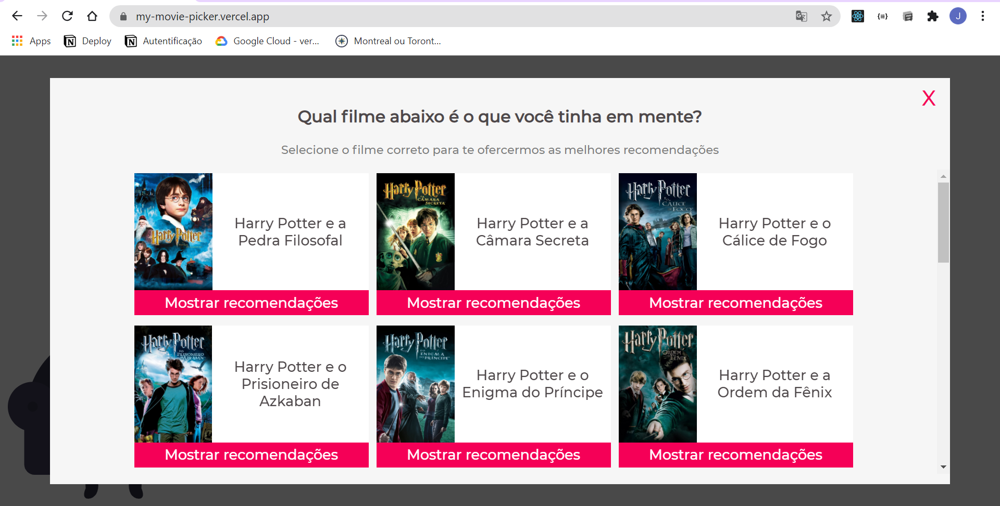

<h1 align="center"></h1>

<p align="center">
 <a href="#project">Projeto</a> •
 <a href="#tech">Tecnologias</a> • 
 <a href="#clone">Clone</a> • 
 <a href="#license">License</a>
</p>

<h2 id="project" >Movie Picker</h2>

O Projeto consiste em uma aplicação web na qual o usuário pode buscar recomendações de filmes baseado em filmes que ele já assistiu e gostou. Primeiro o usuário fornece o nome de um filme e escolhe dentre os resultados qual é o que tinha em mente e baseado nessa escolha algumas opções de filmes serão recomendadas para ele!

<h3 align="center"><a href="https://my-movie-picker.vercel.app/">💻 Visite clicando aqui</a></h3>

<p align="center">
  
  
  
</p>

<h2 id="tech" >Tecnologias</h2>

- React JS

- Axios

- The Movie Database API

- JavaScript

- HTML e CSS

<h2 id="clone" >Clone</h2>

Para rodar o Movie Picker localmente em modo desenvolvimento você deve:

```
git clone https://github.com/Fernanda-Kipper/Movie-Picker.gi
cd project_name
npm install
npm run-script dev
# Acesse o localhost
http://localhost:3000
```

No local de npm você pode utilizar o package manager de sua preferência

### Atenção ‼

Não é recomendado armazenar suas chaves de acesso a API no lado do cliente, nesse projeto fora utilizado as variáveis de ambiente react app estritamente para estudo e prática, mas em modo de produção esssa prática não é recomendada 

<h2 id="license">Licença</h2>

Esse projeto está sob a licença [MIT](LICENSE)

