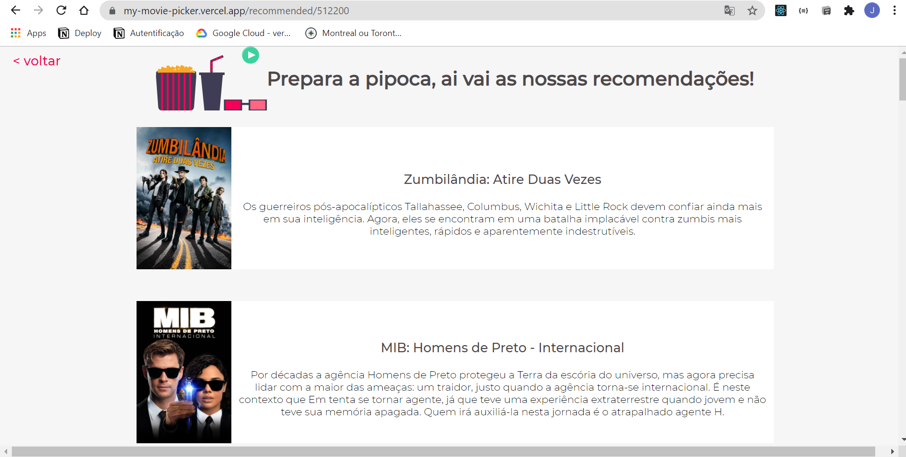

<h1 align="center"></h1>

<p align="center">
 <a href="#tech">Technolgies</a> • 
 <a href="#clone">Clone</a> • 
 <a href="#contribute">Contribute</a> •
 <a href="#license">License</a>•
 <a href="https://my-movie-picker.vercel.app/">Visit site</a>
</p>

<p align="center">
<b>Movie picker is an application in which the user can search movie recommendations based on movies he has watched and liked.</b>
</p>
<p align="center">
   
   
   
</p>


<h2 id="tech">Technologies</h2>

- React JS

- Axios

- [The Movie Database API](https://developers.themoviedb.org/3/getting-started/introduction)

- JavaScript

- HTML e CSS

<h2 id="clone">Clone</h2>

<h4> Prerequisites</h4>

- Node >= 10.16 e npm >= 5.6 
- Package manager - NPM or YARN

<h4>Starting</h4>

```
git clone https://github.com/Fernanda-Kipper/Movie-Picker.git
npm install
npm run-script dev
OPEN http://localhost:3000
```

### Atention 🛑

It is not recommended to store your API access keys on the client side, in this project the react app environment variables were used strictly for study and practice, but in production mode this practice is not recommended

<h2 id="contribute">Contribute 🚀</h2>

If you want to contribute, clone this repo, create your work branch and get your hands dirty!

```bash
git clone https://github.com/Fernanda-Kipper/LiveChat.git
git checkout -b feature/NAME
```

 At the end, open a Pull Request explaining the problem solved or feature made, if exists, append screenshot of visual modifications and wait for the review!

[How to create a Pull Request](https://www.atlassian.com/br/git/tutorials/making-a-pull-request)

[Commit pattern](https://gist.github.com/joshbuchea/6f47e86d2510bce28f8e7f42ae84c716)


<h2 id="license">License 📃 </h2>

This project is under [MIT](LICENSE) license


